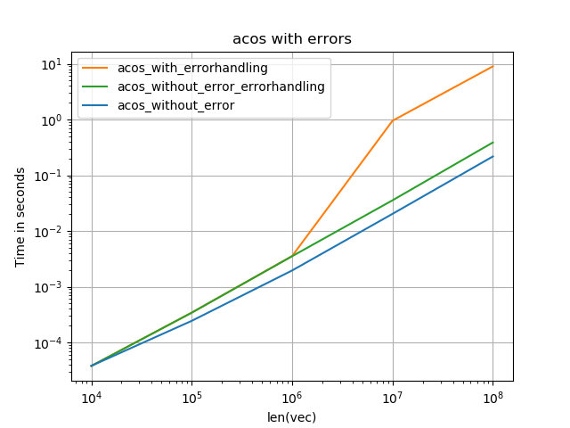
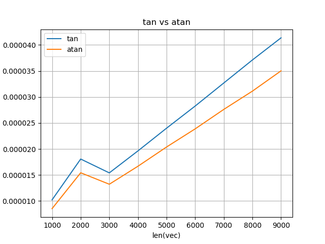
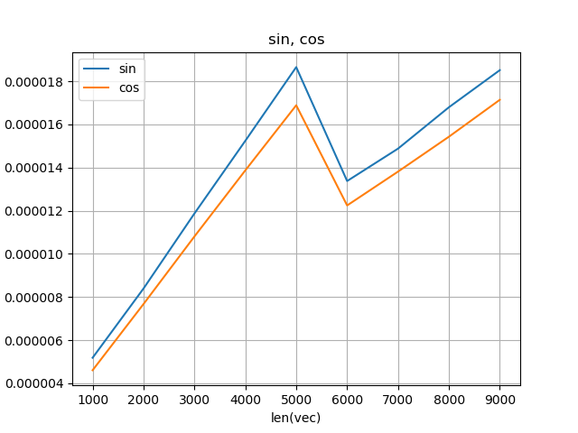
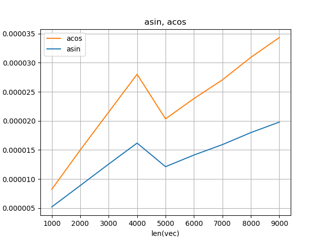
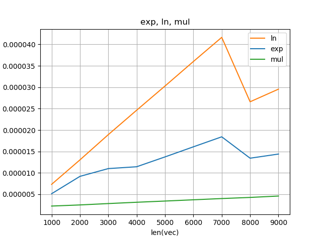
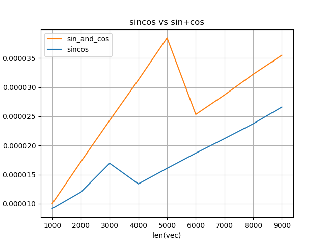

# cyvml

cython-wrapper for intel's vml

## About

A cython wrapper to experiment with Intel's VML. It works out of the box for Anaconda-Distribution with MKL on Linux. MKL-includes aren't needed - `cyvml` has the necessary parts of the API (even if it is somewhat dirty and brittle).

On Windows one needs to provide path to *.lib-files even for Anaconda-Distribution, as it doesn't ship them. One also has to take care of dlls being on the PATH.

For Anaconda distribution

   conda install mkl-devel

might be the easiest solution to get all what is needed.

Not yet all functions are wrapped - they will be added as needed.

## Instalation:

To install the module using pip run:

    pip install https://github.com/realead/cyvml/zipball/master

It is possible to uninstall it afterwards via

    pip uninstall cyvml

You can also install using the setup.py file from the root directory of the project:

    python setup.py install

or 

    pip install -e .

to install in development mode.

In order to provide/use a different mkl-distribution, rename `site.cfg.example` to `site.cfg` and adjust the needed values. Then use the installation commands from above.

## Usage

The functions for `cimport` have prefix `cy_`, for example:

    %%cython
    cimport cyvml.cyvml as vml

    cdef double x = 1.0
    vml.cy_vdExp(1, &x, &x)

The functionality can be used also from pure Python with anything supporting buffer protocol - the functions have prefix `py_`:

    import numpy as np
    import cyvml.cyvml as vml

    x = np.array([np.pi*2], dtype=np.float64)
    y = np.array([42.42], dtype=np.float64)
    vml.py_vdCos(x,y)

### Service functions:

 * To adjust the number of vml-threads, use `cy/py_set_vml_num_threads` and `cy/py_get_vml_max_num_threads` which are aliases for `MKL_Domain_Set_Num_Threads` and `MKL_Domain_Get_Max_Threads` with domain already set to `MKL_VML`.

 * However, it might be wiser to use `mkl_set_num_threads_local` as it doesn't affect other parts of program.

 * There are also `cy/py_vmlSetMode` and `cy/py_vmlGetMode`.

## Experiments

Once cyvml is installed, the scripts from `tests/experiments` can be used.

#### costs of `cy_get_vml_max_num_threads`

The cost of calling `cy_get_vml_max_num_threads` followed by two `cy_set_vml_num_threads` (which corresponds to querying the current state, setting it to a new number and restoring) is about 100 ns (see `cyvml.onoff_multithreading`).

#### costs of `cy_mkl_set_num_threads_local` 

Due to the signature only two calls are needed to set/reset local number. This approach is almost twice as fast as the approach with `cy_get_vml_max_num_threads`.

#### costs of  setting/getting mode:

   Call of `vmlSetMode` has cost of about 50 ns.

#### no error reporting

   The costs for functions which have to set error (like acos(2.0)) are quite high, all above when calculation runs in parallel - up to factor 50! Setting error mode to `PY_VML_ERRMODE_ERRNO`, i.e. `VML_ERRMODE_ERRNO` - no error reporting mitigate the impact - it becomes only 2 times slower.

#### switching to multi-threading (for doubles)

Depending on the function MKL chooses to run in parallel, depending on the size of the vector:

    Function    | multithreading
    --------------------------
    cos, sin    |  5000-6000
    acos, asin  |  4000-5000
    tan, atan   |  2000-3000
    exp, ln     |  7000-8000
    mul         |  never?

Here are the runtimes, where knick means that the multi-threading is used:

#### performance of sincos vs sin & cos

Function `vdSinCos` calculates sin and cos in one go => there must be some synergies. And there are - `vdSinCos` is about 33% faster than `Sin` and `Cos` together:

Also multithreading kicks in between 3000-4000 elements.

## Testing

For testing of the local version run:

    `sh test_in_active_env.sh`

in the `tests` subfolder.

